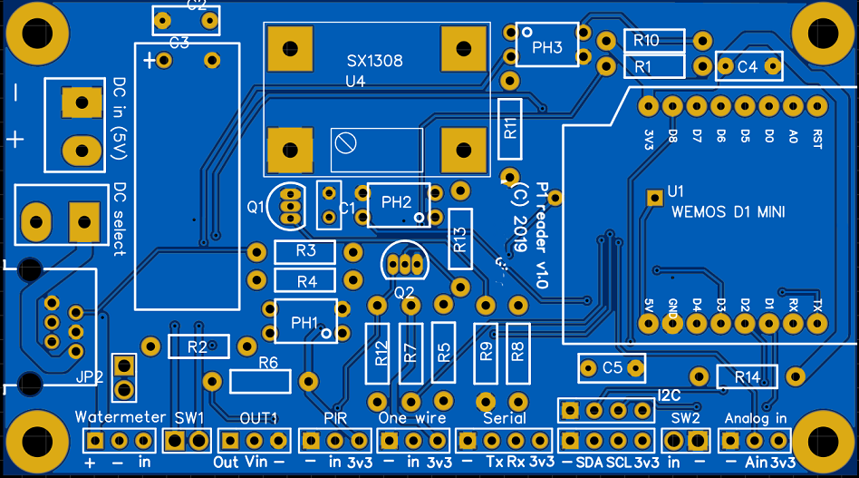

# DSMR_reader_schematic_PCB

Note: this is my first repository on github so please bare with me....more details to be added later

This repository contains a schematic and PCB layout for a dutch ESMR/DSMR smart meter reader via the P1 port. Key features are:
- Based on wemos d1 mini (ESP8266, 1M FLASH)
- inverted serial port using BC547 transistor
- Power can be taken from the smart meter or from an external source (both 5V input), selectable via a jumper
- telegram readings from the P1 port can be controlled through a GPIO output that is connected to the data request pin via an opto-coupler
- You can also read a water meter through an inductive pulse sensor. The PCB also has room for a small SX1308 boost DC-DC convertor as some of these need a voltage higher than 5V
- While i was at it: connections to add other switches, buttons and sensors such as a PIR, 1-wire, serial, I2C. So in fact you could even use the PCB for completely different purpose than smart meter reading....

The reason I decided to design the PCB was (1) I wanted to use a Wemos and i needed to hook it up to the rest of the circuit shown above and I really hate wiring protytype PCBs - lots of work and always full of errors that are difficult to resolve. Also (2) that I did not see any other projects at that time that had a PCB using something like a WEMOS or did not use the data request pin or could not be powered from the smart meter. And (3) I wanted something more generic so that I could hook up more sensors or buttons and in any case a circuit for reading my water meter using a pulse sensor of some kind or even use it for something completely different beyond the smart meter.

The schematic as shown above only shows the parts relevant for the smart meter reader. It consists of a serial port convertor, data request circuit and the wemos. The circuit is essentially designed to work for ESMR5 meters. I have a Sagemcom XS210 which is ESMR5. It may wotk for other smart meters but you may have to tweak. Some older DSMR/ESMR meters do not have a power supply and/or can only deliver less power, some do not have the inverted serial port or may have outputs that are not isolated through and opto-coupler.

Usage:
The circuit can be fed from the 5V in the smart meter or by an external power supply. By default it will take power from the meter. If you want to power it externally then short-circuit JP1. However this connects the external 5V to the meter's 5V so in that case do not use a 6-pin but 4-pin cable or make sure your meter does not deliver 5V. Else 2 power supply will be connetced together and that's generally bad practice.

The smart meter can deliver 250 mA and this will not be enough for the ESP during peak load. Hence I put a fairly large capacitor on the input, C2. I am using a low ESR elco (low internal resistance) of 1500uF. Do note that I have read reports that some meter deal poorly with the large elco as it has a high peak current power up and the current protection of the meter kicks in and for some meters does not recover. 

By default the circuit will use the data request pin via the opcocoupler PH11 circuit, which converts the 3v3 from GPIO D7 to 5V using the smart meter's 5V. When high (5V on Data request), the meter sends telegrams via the serial port each second until low again. If you don't want to use this then short-circuit JP2 (put a cap on the pins or simply solder a wire). I don't recommend this since it may load the ESP as it needs to handle serial traffic each second and particularly if you also want to have it do other stuff this may cause instability.

Some other things to consider: I have mounted the Wemos D1 mini in a header as you can see in the picture down below. This meaas it can be easiliy taken out if you ever want to reflash it using its USB or leave it in the PCB and flash it using USB. You can leave out the header and solder it direclty to the PCB but then it's too low for the average USB plug so you cannot plug it into USB as e.g. R13 will be in the way. It is still possible to use an external FTDI USB to serial using the serial header. To flash, You will need to connect GPIO0 to ground on boot. This can be achived by connecting the top side (see PCB picture) of R13 to ground. This side of R13 connects to pin D3 of the Wemos which is GPIO0. If you don't populate R13 (and you don't need to if you are just using the PCB as smart meter reader) you can also solder a pin to it, then use a wire to connect to one of the GND pins. OK, not the greatest part of this design but with some effort it can be done.

Beyond the smart meter circuit, the PCB has some other possibilities to connect sensors or switches. It can be seen in the [full schematic](files/Schematic_P1_reader_full_PCB_V1.0.pdf). Some things worth mentioning:
- design flaw 1: Do NOT ever place R14. this pin must have a resistor to ground, if you connect a pull-up resistor the ESP will not boot. Note you cna still use this as input or output to connect something, just don't use a pull-up
- Design flaw 2: the buzzer circuit uses D3 which is GPIO0 and this has a pull-up resistor to ensure normal boot. This however will also pull the base of the BC537 to Vcc which means it will consudt, thus activate the buzzer. While the sketch can prevent this by pulling it low by default, if for whatever reason the sketch does not do this or at boot time before the pin is initialized the buzzer will sound and potentially can keep on buzzing untill you  pull the plug.....if for whatever reason you do mount the buzzer, it goes on the bottom side of the PCB and you ened to mount it before mounting the wemos....

For code to run on the wemos D1 mini ESP8266 I'll refer you to the following links:

[CustomP1UartComponent](https://github.com/nldroid/CustomP1UartComponent "CustomP1UartComponent by nldroid") by nldroid. This uses the [ESPhome](https://esphome.io/index.html) framework. I have not tested this yet myself but likely will in the near future, as I am planning to start using more ESPhome and also want to combine this firmware with the pulse reader fo the water meter. Note you will need to change the pin for the data request to D7 - the CustomP1UartComponent is using D5.

Another build for P1 smart meter readings is from [this](https://willem.aandewiel.nl/index.php/2019/04/09/dsmr-logger-v4-slimme-meter-uitlezer/) site from Willem Aandewiel (warning: Dutch only). The code and more is also on his [Github](https://github.com/mrWheel/DSMRloggerWS). I'm current running this firmware (version 1.0.4) and it's running quite stable since November last year. In any case proof that the PCB seems working fine. I have a FSMR5 meter and I'm powering the PCB from the 5V inside the smart meter (Did you know by the way this is free? - Yes really, the built-in smart meter power supply is not metered and delivers 5V / 250mA)

Here you can see the PCB connected to my smart meter. Still 'bare naked', no housing yet...

